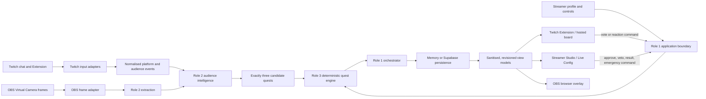

# ChatXPT Architecture and Codebase Guide

This guide explains how ChatXPT is structured, how data moves through the system, and what the major files do. It is an implementation companion to [`ARCHITECTURE.md`](ARCHITECTURE.md), which defines the higher-level target architecture, and [`build-plans/INTEGRATION-CONTRACT.md`](build-plans/INTEGRATION-CONTRACT.md), which defines the binding role-to-role seams.

**Evidence basis:** source inspection of the finals integration branch through `38dca70` on 18 August 2026. Runtime and external-service proof remain separately tracked in `docs/evidence/manifest.json`.

## 1. Read this first: implementation status

ChatXPT currently contains two paths that must not be confused:

1. **The retained local prototype path** powers `/`, `/overlay`, `/api/sidequests`, `/api/demo-participation`, and `/api/overlay-state`. It remains available as a labelled diagnostic/rehearsal fallback under D-064, but it still uses files in `src/components/` and `src/lib/`, process-local compatibility state, and browser storage.
2. **The canonical production-shaped path** now mounts Studio, Twitch Config and Live Config, the Twitch viewer, the hosted Quest Board, signed Twitch-chat ingestion, Gameplay Capture ingress, and the read-only OBS overlay. These surfaces share versioned contracts, one deterministic quest authority, one revisioned orchestrator, memory/Supabase persistence adapters, authenticated commands, and role-specific views. Source and automated checks are complete for this boundary; external Twitch, OBS, Supabase Cloud, and Vercel evidence is still required before describing it as a proven production deployment.

The status labels used below mean:

| Label | Meaning |
| --- | --- |
| **Mounted** | Reachable through a current Next.js page or API route. |
| **Implemented** | Code and automated tests exist behind a public boundary, but the component may not yet be mounted in the complete product flow. |
| **Diagnostic** | Intended for local development, fixtures, or reproducibility; it is not live-product evidence. |
| **Production-shaped** | Implements the intended security or architecture boundary, but external deployment/runtime proof is still required. |
| **Planned / partial** | The interface or some pieces exist, but the complete accepted workflow is not implemented or proven. |

No simulated fixture, signed-token unit test, static SQL inspection, or source review proves a real Twitch, OBS, Supabase Cloud, or deployed Vercel run. Real evidence belongs in `docs/evidence/manifest.json`.

## 2. Architecture at a glance



The dependency rule is deliberately one-way:

- The core defines neutral contracts and application ports.
- Twitch, OBS, Supabase, AI, extraction, quest logic, and UI implement or consume those ports.
- Responsibility-specific modules communicate through their public `index.ts` entrypoints rather than importing another module's private files.
- Thin files under `src/app/` are the composition layer. They may mount role-owned modules, authenticate requests, and connect public ports.
- The orchestrator is the sole authority for canonical command ordering, idempotency, state revision, persistence, and publication.

## 3. Module and contributor responsibility

| Role | Responsibility | Primary source |
| --- | --- | --- |
| Role 1 — integration | Shared contracts, orchestration, Twitch/OBS adapters, persistence, realtime, routes, and cross-role tests | `src/core/`, `src/integrations/`, `src/realtime/`, thin `src/app/`, `tests/integration/`, `supabase/` |
| Role 2 — intelligence | Frame and audience analysis, observation fusion, model/provider boundaries, and candidate generation | `src/extraction/`, `src/ai/` |
| Role 3 — quest engine | Intervention timing, deterministic validation, lifecycle, completion, scoring, and fallback quests | `src/quest-engine/` |
| Role 4 — streamer UI | Studio, Live Config experience, setup/status presentation, and the shared visual system | `src/streamer/`, `src/design-system/` |
| Role 5 — viewer UI | Twitch viewer, hosted viewer, chat instructions, active-quest/result presentation, and overlay visuals | `src/viewer/` |

`AGENTS.md` defines the model, `.github/CODEOWNERS` routes review context, and `scripts/check-role-boundaries.mjs` enforces dependency direction. Under D-071, any contributor may edit any area without prior role approval; the mapped responsibility, public entrypoints, and import boundaries still determine where code belongs. The retained `src/lib/` and `src/components/` trees are explicitly treated as legacy until the open migration decisions are settled.

## 4. The canonical end-to-end flow

### 4.1 Capture and normalise inputs

1. A `FrameSource` adapter samples real browser/OBS video frames without storing the stream.
2. Role 2 downsamples frames, measures luminance and frame-to-frame change, classifies broad activity, and invokes selective OCR only for configured regions when justified.
3. Observations retain source identifiers, timestamps, confidence, and provenance. Unsupported, stale, conflicting, or unavailable facts remain `unknown`.
4. Twitch chat adapters turn trusted Twitch events into platform-neutral audience events. Exact `1`, `2`, or `3` messages can also become canonical fallback vote commands.
5. The audience pipeline aggregates categories, energy, intent, repetition, and negative pressure without retaining raw chat in the intelligence snapshot.

### 4.2 Decide whether to propose a quest

`InterventionCoordinator` asks Role 3's intervention policy whether the current session, quest state, cooldown, intelligence confidence, and streamer profile permit a new quest. If the answer is no, generation does not run.

When generation is allowed, Role 2's provider boundary produces exactly three `QuestCandidate` records. D-072 permits the server-side OpenAI `gpt-5.6-terra` path, while the permanent no-credential implementation remains algorithmic. The provider uses the same validated boundary and falls back safely on timeout, malformed output, missing credential/credit, or provider failure; caller cancellation propagates without producing candidates.

### 4.3 Validate and run the quest lifecycle

Role 3 validates candidate safety, freshness, feasibility, readability, diversity, timing, streamer boundaries, and recent-history duplication. Invalid provider output cannot become authoritative state. If needed, the deterministic fallback library supplies replacements using the same schema.

The engine owns the state transitions:

```text
idle/evaluating -> proposed -> voting -> active -> succeeded | failed | cancelled | skipped
                                                 \-> expired
terminal state -> cooldown -> next eligible cycle
```

The engine also resolves ties, zero-vote closes, manual and automatic progress, rewards, and emergency interruption. Audience activity can influence a quest, but it cannot prove that an in-game objective was completed. Automatic completion requires fresh, sufficiently confident gameplay evidence.

### 4.4 Commit before publishing

Every canonical action enters `ChatXptOrchestrator` as a versioned `CommandEnvelope`. The orchestrator:

1. validates the command and current stored state;
2. authenticates and authorises the actor;
3. checks command identity and payload fingerprint for retries;
4. rejects stale expected revisions;
5. enforces the emergency latch and command-specific prerequisites;
6. invokes the pure quest engine or a Role 1-owned special command path;
7. stamps the next state revision and canonical events;
8. atomically persists state, events, and the command receipt;
9. projects separate streamer, viewer, and overlay views;
10. publishes those sanitised views after the commit succeeds.

If publication fails after persistence, the command remains committed and is marked for recovery. This avoids showing a state that was never stored.

### 4.5 Recover and render

The shared viewer snapshot never contains private voter identity or another viewer's receipt. A verified viewer can separately recover only their own accepted choice through a pseudonymous, session-scoped voter key. The Twitch Extension client accepts refreshed authorisation from Twitch and reloads the latest view; the server application retries a vote once when a concurrent command makes its expected revision stale.

Role 4 and Role 5 components render the role-specific view models. They do not calculate the authoritative winner, rewrite rewards, or own the quest clock.

## 5. What is actually mounted today

### Root control room and local overlay

The `/` route mounts `ControlRoom`, a retained all-in-one client component. It can request browser display capture, derive a broad `quiet`, `action`, `transition`, or `unknown` activity signal, read Twitch IRC chat anonymously, accept exact `1`/`2`/`3` chat votes, call `/api/sidequests`, stage a diagnostic vote, activate a quest, and send results.

This path is **mounted and useful**, but it is not the final composition. Candidate generation still passes through `src/lib/mock-engine.ts` or the legacy optional OpenAI adapter. Some vote/overlay state is process-local or browser-local, and the overlay derives a local display clock. It must not be described as durable multi-client authority or live extraction proof.

### Canonical management and participation surfaces

`/studio`, `/config.html`, and `/live-config.html` mount Role 4's canonical management surfaces. A broadcaster starts or recovers a channel-bound session through the secure D-065 manual bootstrap, then receives a signed, `HttpOnly`, `SameSite=Strict` Studio grant. Studio owns persistent configuration and setup; Live Config exposes only the compact stream-time command set. Twitch Config and Live Config can also authenticate the broadcaster through Twitch's Extension JWT.

`/viewer.html` uses Twitch's Extension Helper JWT. The server verifies its HS256 signature, expiry, channel, role, and opaque/anonymous viewer identity. Reads, votes, and reactions pass through `TwitchExtensionViewerApplication`, the shared persistence runtime, and the canonical orchestrator. Voting is select-then-confirm and first accepted vote is final.

`/quest-board/[roomCode]` is the first fallback. It exchanges a room code for a scoped, signed, `HttpOnly` anonymous viewer grant, derives a stable browser voter identity, and uses the same viewer projection, vote ledger, reaction commands, countdown, result, and recovery behaviour as the Extension. It does not create a second source of vote truth.

`POST /api/twitch/eventsub` is the final `1`/`2`/`3` fallback input. It verifies Twitch's raw-body HMAC, timestamp and message freshness, challenge requests, and notification type before exact vote messages enter the same first-vote-final ledger. Ordinary chat and raw Twitch identities are not stored by this boundary; votes are counted silently and the result is shown on the overlay.

### Canonical OBS and gameplay paths

`/obs-overlay` mounts Role 5's canonical transparent overlay. Studio issues a short-lived, session-bound setup URL whose signed access token is carried in the URL fragment rather than the query string. The client moves it into an `Authorization` header, and the read-only state endpoint projects committed overlay state. An overlay read also asks the trusted scheduler path to close a due vote, so chat-only participation does not require a viewer browser to own the timer.

`/diagnostics/gameplay-extraction` remains visibly diagnostic when used with fixtures, but it can also select a real OBS Virtual Camera, sample frames locally, derive universal activity/capture-health observations, and submit only normalised snapshots through a signed, session-bound Gameplay Capture grant. Raw frames stay in the browser. Calibrated HUD facts remain diagnostic until separately proven.

`/diagnostics/ui-harness` remains fixture-only. Real Twitch Local/Hosted Test, EventSub delivery, OBS capture, Supabase Cloud, and Vercel claims still require external configuration and recorded evidence.

## 6. Routes and external surfaces

| Route | Major entry file | Purpose and current status |
| --- | --- | --- |
| `/` | `src/app/page.tsx` | Mounts the retained local control room. **Mounted, legacy/diagnostic composition.** |
| `/studio` | `src/app/studio/page.tsx` | Mounts the canonical full Studio management surface and secure manual broadcaster-session start/recovery. **Mounted canonical path.** |
| `/config.html` | `src/app/config.html/page.tsx` | Mounts the canonical Twitch Extension configuration surface for setup and persistent management. **Mounted canonical path.** |
| `/live-config.html` | `src/app/live-config.html/page.tsx` | Mounts the compact Twitch Creator Dashboard live-control surface. **Mounted canonical path.** |
| `/viewer.html` | `src/app/viewer.html/page.tsx` | Mounts the authenticated Role 5 Twitch Extension viewer client for reads, final votes, recovery, and reactions. **Mounted canonical path.** |
| `/quest-board/[roomCode]` | `src/app/quest-board/[roomCode]/page.tsx` | Mounts the signed anonymous hosted fallback over the shared participation service. **Mounted canonical fallback.** |
| `/obs-overlay` | `src/app/obs-overlay/page.tsx` | Mounts the read-only, authenticated, transparent Role 5 OBS overlay. **Mounted canonical output.** |
| `/overlay` | `src/app/overlay/page.tsx` | Mounts the retained local overlay. **Legacy/diagnostic compatibility only.** |
| `/diagnostics/gameplay-extraction` | `src/app/diagnostics/gameplay-extraction/page.tsx` | Runs fixture diagnostics or authenticated real-camera Gameplay Capture; real and simulated states are labelled separately. |
| `/diagnostics/ui-harness` | `src/app/diagnostics/ui-harness/page.tsx` | Shows canonical UI fixture states. **Diagnostic only.** |
| `POST /api/sidequests` | `src/app/api/sidequests/route.ts` | Validates legacy generation input and returns exactly three local algorithmic quests, optionally trying the legacy OpenAI adapter first. |
| `GET/POST /api/demo-participation` | `src/app/api/demo-participation/route.ts` | Bridges the local control room to a staged diagnostic cycle, votes, progress, and results. Process-local helper state is not durable evidence. |
| `GET/POST /api/overlay-state` | `src/app/api/overlay-state/route.ts` | Process-local compatibility transport for the retained overlay. |
| `/api/studio/session*`, `/api/studio/commands` | `src/app/api/studio/` | Starts/recovers a channel session, returns the canonical streamer projection, and submits authorised streamer commands. |
| `GET /api/twitch/extension/viewer` | `src/app/api/twitch/extension/viewer/route.ts` | Authenticates a Twitch viewer and returns a sanitised canonical view plus that viewer's private vote recovery. |
| `POST /api/twitch/extension/commands` | `src/app/api/twitch/extension/commands/route.ts` | Authenticates and submits canonical Twitch viewer vote and reaction commands. |
| `POST /api/twitch/eventsub` | `src/app/api/twitch/eventsub/route.ts` | Verifies raw Twitch EventSub webhook messages and adapts exact chat votes into canonical commands. |
| `/api/hosted-board/*` | `src/app/api/hosted-board/` | Exchanges a room code for signed anonymous access and serves hosted viewer reads, votes, reactions, and recovery. |
| `/api/obs/overlay/grant`, `GET /api/obs/overlay/state` | `src/app/api/obs/overlay/` | Issues a read-only OBS setup descriptor and returns session-bound canonical overlay state. |
| `/api/gameplay/ingress/grant`, `POST /api/gameplay/ingress/snapshot` | `src/app/api/gameplay/ingress/` | Issues a session-bound Gameplay Capture grant and accepts only validated normalised snapshots. |
| `GET /api/twitch/setup/readiness` | `src/app/api/twitch/setup/readiness/route.ts` | Reports Twitch environment/setup readiness without exposing secrets. |
| `GET /api/twitch/oauth/callback` | `src/app/api/twitch/oauth/callback/route.ts` | Reserved OAuth callback boundary that currently reports token exchange as unavailable. |
| `/api/ui-gateway/*` | `src/app/api/ui-gateway/` | Serves canonical diagnostic fixtures and validates authorised command examples for UI development. |
| `GET /api/health/deployment` | `src/app/api/health/deployment/route.ts` | Returns safe server-side deployment/service health. |

## 7. Major file guide

The following tables cover files that define architecture, runtime behaviour, composition, or major product surfaces. Small barrel files mainly re-export their directory's public API. Repetitive `*.test.ts` files are grouped in the testing section rather than listed one by one.

### 7.1 Repository authority and build configuration

| File | What it does |
| --- | --- |
| `AGENTS.md` | Binding product direction, five-role responsibility model, open cross-role contribution, Twitch-only MVP scope, golden workflow, evidence rules, and collaboration constraints. |
| `README.md` | Main setup, surface, architecture, prompt/agent, dependency, API, and repository disclosure for contributors and submission reviewers. |
| `docs/ARCHITECTURE.md` | High-level accepted target architecture, dependency direction, contracts, realtime boundary, security rules, and migration status. |
| `docs/build-plans/INTEGRATION-CONTRACT.md` | Binding producer/consumer contract: orchestrator order, view ownership, revisions, persistence-before-broadcast, fixture rules, and cross-role acceptance ladder. |
| `docs/DECISIONS.md` | Durable accepted and proposed owner decisions. Entries marked `Proposed` remain open. |
| `docs/architecture/LEGACY-MIGRATION-INVENTORY.md` | Factual inventory of retained prototype files, mixed responsibilities, open migration decisions, and safe migration order. |
| `package.json` | Defines Next.js lifecycle commands, focused test commands, the full `npm run check` gate, and runtime/development dependencies. |
| `package-lock.json` | Locks the exact npm dependency graph used by CI and local installs. |
| `.env.example` | Documents blank, non-secret configuration keys and separates public browser values from server-only credentials. |
| `next.config.ts` | Adds security headers and CSP allowances needed by Twitch Extension framing, Twitch/Supabase connections, camera capture, and local development origins. |
| `tsconfig.json` | Enables strict TypeScript settings and the `@/* -> src/*` import alias. |
| `vitest.config.mts` | Configures the test environment, aliases, and test discovery. |
| `vercel.json` | Defines the Vercel install and build commands. It does not prove a deployment exists. |
| `.github/CODEOWNERS` | Routes default responsibility and integration-review context. It is not an edit or merge-permission map under D-071/D-073. |

### 7.2 Next.js composition and compatibility files

| File | What it does | Status / caution |
| --- | --- | --- |
| `src/app/layout.tsx` | Defines the root HTML layout, global metadata, and the one app-level global stylesheet import. | Mounted. |
| `src/app/index.ts` | Public entrypoint used by integration tests and consumers of app-owned route/application seams. | Implemented. |
| `src/app/page.tsx` | Thin root route that mounts `ControlRoom`. | Mounted retained prototype. |
| `src/components/control-room.tsx` | Large client-side prototype combining capture, chat, profile controls, generation, local voting, automation, activation, completion, and analytics. | Mounted; intentionally awaiting ownership migration. |
| `src/app/api/sidequests/route.ts` | Validates legacy generation requests and selects the optional legacy OpenAI adapter or credential-free legacy algorithmic fallback. | Mounted compatibility endpoint. |
| `src/lib/domain.ts` | Zod schemas and TypeScript types used only by the retained prototype generation and overlay path. | Legacy; canonical replacements live in `src/core/contracts/`. |
| `src/lib/demo-data.ts` | Synthetic battle-royale-flavoured input used to prefill the prototype. | Fixture/diagnostic only; not product scope or live data. |
| `src/lib/mock-engine.ts` | Deterministically produces three legacy sidequests and applies simple boundaries, points, and fallback logic. | Credential-free mounted fallback, but mixes future Role 2 and Role 3 responsibilities. |
| `src/lib/openai-engine.ts` | Optional server-only structured OpenAI generation adapter for the legacy endpoint. | Not the accepted judged path or an adopted provider decision. |
| `src/lib/overlay-store.ts` | Synchronises the retained active quest through `localStorage`, `BroadcastChannel`, and the overlay-state endpoint. | Same-browser/local compatibility transport. |
| `src/components/overlay-stage.tsx` | Renders the retained OBS overlay, polls diagnostic participation, reads the local store, and derives a display timer. | Mounted; client timer is not canonical authority. |
| `src/app/api/overlay-state/route.ts` | Stores one active quest in the Next.js server process for compatibility. | Non-durable local state. |
| `src/app/api/demo-participation/route.ts` | Stages diagnostic cycles and bridges local quest/vote/progress/result actions into the canonical Twitch viewer application when possible. | Local diagnostic bridge; not a public participation API. |
| `src/app/server/runtime.ts` | Owns the process-shared persistence runtime and constructs the sole canonical orchestrator with a request-scoped verified actor. | Mounted server composition root. |
| `src/app/server/studio-session.ts` | Authenticates manual setup or Twitch broadcaster JWTs, starts/recovers sessions, projects Studio state, persists configuration, and submits streamer controls. | Mounted canonical management path. |
| `src/app/server/twitch-extension-viewer.ts` | Authenticates viewer reads, votes, and reactions; binds channel/session identity; recovers the current viewer's receipt; and retries one stale vote safely. | Mounted canonical viewer path. |
| `src/app/server/hosted-board.ts` | Exchanges room codes for signed anonymous grants, derives stable private voter keys, and routes hosted reads/commands through the same participation authority. | Mounted canonical fallback. |
| `src/app/server/twitch-chat.ts` | Applies verified EventSub chat notifications to exact `1`/`2`/`3` vote adaptation and the shared ledger without retaining raw text or Twitch user IDs. | Mounted inbound chat fallback. |
| `src/app/server/obs-overlay.ts` | Issues session-scoped read-only overlay grants, closes due votes through the trusted system command, and projects canonical overlay state. | Mounted canonical output. |
| `src/app/server/gameplay-ingress.ts` | Issues Gameplay Capture grants and commits validated normalised gameplay snapshots to the authoritative session. Raw frames never cross this boundary. | Mounted canonical input. |
| `src/app/streamer-authorized-client.tsx` | Connects Studio, Config, and Live Config to their authenticated server state and authorised command endpoints. | Mounted reusable client shell. |
| `src/app/viewer.html/twitch-extension-viewer-client.tsx` | Connects to Twitch's Extension Helper, refreshes JWT-backed views, submits confirmed votes/reactions, handles recovery, and renders the Role 5 surface. | Mounted. |
| `src/app/quest-board/[roomCode]/hosted-board-client.tsx` | Bootstraps signed anonymous room access and renders the same canonical Role 5 participation surface for hosted fallback users. | Mounted. |
| `src/app/obs-overlay/obs-overlay-client.tsx` | Reads the fragment-held OBS token, removes it from browser history, sends authenticated polling requests, and renders the transparent canonical overlay. | Mounted. |
| `src/app/diagnostics/gameplay-extraction/GameplayExtractionDiagnostic.tsx` | Separates fixture diagnostics from real camera capture and submits only normalised snapshots when linked to an authorised session. | Mounted; evidence classification remains explicit. |
| `src/app/diagnostics/ui-harness/page.tsx` | Mounts canonical streamer/viewer fixture states for development review. | Explicitly diagnostic. |
| `src/app/globals.css` | App-level and retained-prototype styling. | Contains legacy presentation alongside app-wide rules. |

### 7.3 Core contracts

| File | What it does |
| --- | --- |
| `src/core/index.ts` | Public root for all canonical contracts and application APIs. Other roles should import through this boundary. |
| `src/core/contracts/common.ts` | Contract version, IDs, timestamps, revisions, actors, evidence classes, domain errors, envelopes, and service health. |
| `src/core/contracts/signals.ts` | Normalised gameplay/audience events, observations, intelligence snapshots, confidence, timestamps, provenance, and capability information. |
| `src/core/contracts/profile.ts` | Persistent streamer profile, game preferences, safety boundaries, voting configuration, and reward settings. |
| `src/core/contracts/session.ts` | Stream-session lifecycle, platform information, connection/capability state, and session events. |
| `src/core/contracts/quests.ts` | Quest candidates, three-option batches, cycle states, progress, completion evidence, results, rewards, and quest events. |
| `src/core/contracts/participation.ts` | Vote sources, accepted votes, tallies, reactions, and participation capability types. |
| `src/core/contracts/commands.ts` | Discriminated command envelopes for streamer, viewer, and system actions. This is the write vocabulary of the application. |
| `src/core/contracts/views.ts` | Sanitised `StreamerViewModel`, `ViewerViewModel`, and `OverlayViewModel` schemas. These are the UI read boundaries. |
| `src/core/contracts/setup.ts` | Setup/readiness services and streamer setup/session command schemas. |
| `src/core/contracts/session-history.ts` | Privacy-safe terminal quest history and aggregate session summaries. |
| `src/core/contracts/ports.ts` | Neutral ports for frames, audience events, analysis, candidate generation, quest decisions, and projection. |
| `src/core/testing/fixtures.ts` | Canonical valid fixture catalog for tests and the UI harness. |
| `src/core/testing/invalid-fixtures.ts` | Deliberately invalid contract examples used to prove rejection behaviour. |
| `src/core/testing/application.ts` | Injected in-memory fakes and application builders used by tests. None are live evidence. |

### 7.4 Core application layer

| File | What it does |
| --- | --- |
| `src/core/application/types.ts` | Defines authoritative stored state, projection context, command receipts, commit results, and orchestrator output. |
| `src/core/application/ports.ts` | Defines the authorizer, repository, receipt, candidate-batch, tally, recovery, projector, publisher, clock, and ID dependencies required by the orchestrator. |
| `src/core/application/schemas.ts` | Runtime validation for authoritative state, stored receipts, and private viewer recovery records. |
| `src/core/application/fingerprint.ts` | Produces stable command-payload fingerprints so a retry can be distinguished from command-ID reuse with different content. |
| `src/core/application/view-projector.ts` | Converts canonical state plus health/context into distinct streamer, viewer, and overlay views while keeping private information out of shared views. |
| `src/core/application/orchestrator.ts` | The central command authority: validation, auth, idempotency, expected revisions, engine invocation, atomic commit, projection, broadcast, and recovery reporting. |
| `src/core/application/intervention-coordinator.ts` | Connects Role 2 intelligence/candidate generation to Role 3 intervention policy and submits an accepted candidate batch through the orchestrator. |
| `src/core/application/ui-gateway.ts` | Publishes canonical fixture snapshots and validates UI command examples for the diagnostic harness. It is not a live backend. |

### 7.5 Twitch and OBS adapters

| File | What it does |
| --- | --- |
| `src/integrations/index.ts` | Public integration entrypoint. |
| `src/integrations/obs/browser-frame-source.ts` | Browser `FrameSource` that selects an OBS Virtual Camera with `getUserMedia`, draws sampled video frames to a canvas, emits canonical frame observations, and exposes cleanup hooks. |
| `src/integrations/obs/browser-source.ts` | Creates a read-only OBS Browser Source descriptor whose access grant is placed in the URL fragment, not a server-visible query. It does not control OBS itself. |
| `src/integrations/obs/overlay-auth.ts` | Signs and verifies short-lived HMAC grants scoped to one broadcaster session and OBS read-only access. |
| `src/integrations/obs/gameplay-ingress-auth.ts` | Signs and verifies separate short-lived grants for normalised Gameplay Capture writes. Overlay and gameplay capabilities are not interchangeable. |
| `src/integrations/twitch/extension-auth.ts` | Verifies Twitch Extension HS256 JWTs, expiry, channel and role claims; parses bearer tokens; derives pseudonymous session-scoped viewer identities. |
| `src/integrations/twitch/studio-session-auth.ts` | Signs, verifies, and serialises secure Studio session cookies after manual setup or Twitch broadcaster authentication. |
| `src/integrations/twitch/eventsub.ts` | Verifies EventSub raw-body HMAC signatures, timestamps, replay freshness, challenge messages, and supported chat-notification payloads. |
| `src/integrations/twitch/chat-votes.ts` | Converts exact trusted Twitch chat messages `1`, `2`, or `3` into canonical vote commands and privacy-bounded audience events with deterministic delivery IDs. |
| `src/integrations/twitch/chat-announcements.ts` | Formats bounded poll-open, result, and acknowledgement messages. It does not send them to Twitch. |
| `src/integrations/chat-fallback.ts` | Maps authoritative vote state and receipts into platform-neutral chat-fallback presentation and delivery policy. |
| `src/integrations/hosted/board-auth.ts` | Signs hosted-board viewer grants and derives browser-local, session-scoped pseudonymous voter identities. |
| `src/integrations/twitch/setup-readiness.ts` | Reports Twitch application, Extension, and EventSub configuration plus the expected callback/surface paths without returning secrets. OBS, Gameplay Capture, persistence, and hosted-board readiness are enforced at their separate server boundaries. |
| `twitch-extension/` | Static upload package for Twitch's viewer/config/live-config surfaces. Its EBS origin must match the deployed HTTPS application before Hosted Test. |

### 7.6 Realtime and persistence

| File | What it does |
| --- | --- |
| `src/realtime/index.ts` | Browser-safe public realtime types and helpers. It intentionally excludes server secrets and privileged clients. |
| `src/realtime/server.ts` | Server-only public entrypoint for environment parsing, memory/Supabase composition, lifecycle, hosted access, and schedulers. |
| `src/realtime/types.ts` | Shared persistence/realtime interfaces, snapshot roles, access grants, session directories, lifecycle records, and timeout constants. |
| `src/realtime/environment.ts` | Chooses memory mode for blank Supabase configuration, Supabase mode for a complete configuration, and a typed unhealthy state for partial configuration. |
| `src/realtime/server-runtime.ts` | Builds the selected persistence runtime and prevents a partially configured deployment from silently pretending to be healthy. |
| `src/realtime/composition.ts` | Binds the repositories, tallies, recovery readers, projector context, and publisher from one coherent runtime into the orchestrator. |
| `src/realtime/memory.ts` | Complete process-memory implementation of authoritative state, receipts, candidate batches, first-vote-final ledger, recovery, snapshots, grants, lifecycle, scheduler reads, and history. |
| `src/realtime/supabase.ts` | Server-only Supabase adapters implementing the same interfaces through tables and RPCs. Secrets stay outside browser exports. |
| `src/realtime/permissions.ts` | Capability matrix that authorises verified broadcaster, moderator, viewer, system, and diagnostic actors per command. |
| `src/realtime/sanitization.ts` | Removes private participation and actor data before shared snapshots are stored or published. |
| `src/realtime/subscriber.ts` | Subscribes to a private Supabase realtime channel, fetches the newest role snapshot, and ignores duplicate or older revisions. |
| `src/realtime/session-lifecycle.ts` | Creates, starts, heartbeats, disconnects, expires, and ends stream sessions with idempotent operation IDs and secure room codes. |
| `src/realtime/vote-close-scheduler.ts` | Finds persisted voting cycles that are due and submits deterministic `system.vote-close` commands so closure does not depend on a browser timer. |
| `src/realtime/hosted-access.ts` | Resolves a room code to an active session, issues scoped viewer read access, and returns the hosted board's direct/share path. |
| `src/realtime/session-history.ts` | Derives privacy-safe quest and engagement history from accepted command receipts without raw chat or viewer identifiers. |
| `src/realtime/deployment-health.ts` | Produces a public-safe service health summary from server environment state. |

### 7.7 AI and extraction

| File | What it does |
| --- | --- |
| `src/ai/algorithmic-candidates.ts` | Accepted credential-free generator. Uses only fresh supported signals, avoids recent titles, records provenance, and always returns exactly three game-neutral candidates. |
| `src/ai/providers.ts` | Wraps intelligence and candidate providers with canonical input/output validation. |
| `src/ai/provider-fallback.ts` | Adds bounded timeouts, cancellation, error classification, output validation, latency observations, and safe algorithmic fallback around an optional provider. |
| `src/ai/PROVIDER_EVALUATION.md` | Defines evidence and reliability checks for the D-072-approved provider without pretending that source configuration proves a live call. |
| `src/extraction/ports.ts` | Defines replaceable frame-measurement, classification, OCR, observation, and snapshot pipeline ports. |
| `src/extraction/visual-measurements.ts` | Downsamples frames and derives luminance/frame-difference measurements with bounded pixel work and ephemeral-frame cleanup. |
| `src/extraction/visual-classification.ts` | Derives thresholds from annotated samples and classifies broad quiet/action/transition/unknown activity plus whether an OCR burst is justified. |
| `src/extraction/selective-ocr.ts` | Crops named regions, preprocesses pixels, calls an injected OCR adapter, and requires repeated confirmation before promoting text-derived facts. |
| `src/extraction/observations.ts` | Fuses multiple evidence candidates into known, unknown, or unavailable observations based on confidence, conflict, age, and source support. |
| `src/extraction/snapshots.ts` | Assembles canonical gameplay and audience snapshots with timestamps, provenance, and honest unknowns. |
| `src/extraction/audience-pipeline.ts` | Maintains a rolling privacy-bounded aggregation of audience categories, energy, requests, intent, votes, and negative pressure. |
| `src/extraction/evidence-catalog.ts` | Classifies whether an asset is authorised and what kind of evaluation/evidence it may support. |
| `src/extraction/real-input-evidence.ts` | Builds reproducible measurement, annotation, OCR, and unknown-handling run reports while retaining live/diagnostic distinctions. |
| `src/extraction/BRAWL_STARS_SAMPLE_ANNOTATIONS.md` | Documents one annotated evaluation sample; it is not a product restriction or proof of a live run. |
| `src/extraction/REAL_INPUT_EVIDENCE.md` | Describes the extraction evidence protocol and current limitations. |

### 7.8 Deterministic quest engine

| File | What it does |
| --- | --- |
| `src/quest-engine/engine.ts` | Pure quest-cycle state machine for proposals, voting, close, winner/tie resolution, activation, ticks, progress, terminal outcomes, cooldown, and emergency actions. |
| `src/quest-engine/validation.ts` | Enforces safety, feasibility, readability, duration, freshness, diversity, and history rules; assembles exactly three valid options; owns deterministic fallback quests. |
| `src/quest-engine/intervention.ts` | Determines whether the current moment is suitable for a new quest using state, cooldown, recent history, profile, emergency state, and confidence-bearing intelligence. |
| `src/quest-engine/outcomes.ts` | Validates manual or evidence-backed automatic progress, computes terminal outcomes, and awards points/hype according to deterministic rules. |
| `src/quest-engine/provider-quality.ts` | Scores future provider output against quest quality and engine-fit criteria for controlled evaluation only. |
| `src/quest-engine/testing.ts` | Exposes test builders/helpers for engine consumers; it is not a production runtime entrypoint. |
| `src/quest-engine/EVALUATION.md` | Records engine evaluation scope and evidence boundaries. |
| `src/quest-engine/PROVIDER_QUALITY_RUBRIC.md` | Human-readable rubric for any future Role 2/3 provider comparison. |

### 7.9 Streamer, viewer, and design system

| File | What it does |
| --- | --- |
| `src/design-system/tokens.ts` | Shared semantic colour, type, spacing, radius, motion, density, and status-token definitions. |
| `src/design-system/components.tsx` | Reusable accessible buttons, cards, fields, panels, progress, notices, and service-status components. |
| `src/design-system/design-system.module.css` | Visual implementation of the shared tokens, focus treatment, target sizes, responsive behaviour, and reduced-motion handling. |
| `src/streamer/studio-setup-shell.tsx` | Renders first-time and returning Studio setup, profile/intelligence settings, service checklist, navigation, and capability-aware unavailable controls. |
| `src/streamer/studio-status.tsx` | Renders compact/full connection health, observed signals, quest status, and emergency state for Studio and live-control contexts. |
| `src/streamer/studio-management.tsx` | Implements the full persistent Studio management surface, session controls, profile/settings panels, integration health, history, and output/input setup cards. |
| `src/streamer/twitch-config.tsx` | Implements the Twitch Config setup companion and deliberately compact Live Config stream-time controls. |
| `src/viewer/presentation.ts` | Converts canonical viewer/overlay views into safe display models, phases, labels, and unavailable/reconnect states without calculating authority. |
| `src/viewer/surfaces.tsx` | Implements Twitch viewer, hosted viewer, chat-instruction, and OBS overlay surfaces. Event handlers emit commands; the component does not own vote truth. |
| `src/viewer/surfaces.module.css` | Responsive, low-distraction viewer/overlay layout, focus, state, progress, countdown, and reduced-motion styles. |

### 7.10 Supabase schema

| File | What it does |
| --- | --- |
| `supabase/config.toml` | Local Supabase CLI project and service configuration. |
| `supabase/migrations/202608030001_chatxpt_foundation.sql` | Creates profiles, sessions, quest cycles, batches, receipts, events, participation, sanitised snapshots, access grants, lifecycle operations, RLS, and atomic commit/broadcast RPCs. |
| `supabase/migrations/202608050001_vote_ledger_identity.sql` | Adds the pseudonymous viewer identity/uniqueness needed for first-vote-final participation and private recovery. |
| `supabase/migrations/202608050002_vote_close_scheduler.sql` | Adds database support for finding due voting cycles and closing them independently of viewer clients. |
| `supabase/tests/database/foundation.test.sql` | Static/local database assertions for tables, policies, privileges, functions, and invariants. Passing it is not Supabase Cloud proof. |

### 7.11 Verification and policy scripts

| File or group | What it does |
| --- | --- |
| `scripts/check-role-boundaries.mjs` | Parses imports with TypeScript, enforces allowed role dependencies and public entrypoints, and permits only the explicit temporary app-to-legacy exception. |
| `scripts/check-client-secrets.mjs` | Scans source/build output for server-only environment names and configured secret values that must not reach browser bundles. |
| `scripts/check-evidence-manifest.mjs` | Validates evidence records, privacy fields, immutable revisions, evidence classes, and artifact references. |
| `scripts/check-demo-runbook.mjs` | Checks that the golden rehearsal runbook preserves required resources, phases, real/fixture distinctions, revision proof, and safety guardrails. |
| `scripts/smoke-canonical-runtime.mjs` | Exercises the built app's canonical Studio, Twitch readiness, hosted-board, EventSub challenge, Gameplay Capture grant, OBS overlay grant/state, and page mounts with explicit memory-backed limitations. |
| `tests/integration/orchestrator.test.ts` | Primary cross-role command tests for ordering, stale/duplicate/concurrent handling, persistence, projection, broadcast, and recovery. |
| `tests/integration/persistence.test.ts` and `supabase-adapters.test.ts` | Run the same persistence expectations against memory and Supabase-shaped adapters. |
| `tests/integration/twitch-extension-viewer.test.ts` | Exercises signed viewer tokens, channel binding, vote finality, identity privacy, refresh, duplicate handling, and stale-revision recovery. |
| `tests/integration/role-entrypoints.test.ts` | Confirms every role exposes its supported public API. |
| Other `*.test.ts`, `*.test.mjs`, and `supabase/tests/` files | Verify the module beside them, including contracts, extraction, AI fallback, engine rules, UI rendering, auth, lifecycle, scheduler, security, routes, and configuration. |

## 8. State, privacy, and failure boundaries

### Sources of truth

- **Canonical quest/session state:** the repository selected by the Role 1 persistence runtime.
- **Accepted votes:** a server-side first-vote-final ledger, never component state.
- **Candidate batches:** persisted separately and consumed by ID during an intelligence-ready command.
- **Shared display state:** sanitised role-specific snapshots derived from committed canonical state.
- **Private viewer acknowledgement:** a scoped recovery read keyed by session and pseudonymous viewer identity.
- **Legacy local overlay state:** compatibility state only; it is not a canonical source of truth.

### Failure behaviour

- Blank Supabase variables select memory mode; partially configured variables produce an unhealthy/misconfigured state rather than silently falling back.
- Provider failure falls back to the no-credential algorithmic generator.
- Invalid candidate output is rejected or deterministically replaced before voting.
- Duplicate commands return their stored receipt; command-ID reuse with a different payload is rejected.
- Stale revisions are rejected. The authenticated Twitch viewer server application reloads state and retries a vote once.
- Broadcast failure after commit returns a committed result with pending recovery rather than rolling back persisted truth.
- Unknown gameplay facts remain unknown. The application must not invent a kill, health value, match phase, or completion result.

### Security and privacy

- Twitch and Supabase secrets are server-only and absent from browser-safe entrypoints.
- Twitch viewer identities are converted to non-reversible, session-scoped keys before participation storage.
- Shared snapshots exclude private vote receipts and direct viewer identifiers.
- Audience intelligence is category/aggregate based; raw chat is not retained in canonical intelligence snapshots.
- Supabase tables use RLS and revoke direct anonymous/authenticated table access; server-owned RPCs perform privileged writes.
- The full build scans both source and built client chunks for leaked secret names or configured values.

## 9. Testing, build, and deployment

`npm run check` is the repository-wide handoff gate. It runs linting, TypeScript validation, ownership-boundary checks, evidence/runbook validation, secret-exposure tests, the Vitest suite, a production Next.js build, and a built-client secret scan.

Useful narrower commands include:

```bash
npm run test:contracts
npm run test:integration
npm run test:persistence
npm run check:boundaries
npm run check:evidence
npm run build
```

The production deployment target is Vercel plus Supabase. The repository contains deployment configuration, environment validation, SQL migrations, adapters, and health endpoints, but source presence alone does not prove a reachable Vercel preview, configured Supabase project, real Twitch registration, or real OBS capture.

## 10. Known architectural gaps and risks

1. **Legacy composition remains visible.** The root control room and `/overlay` remain as diagnostic/rehearsal fallbacks until the canonical seven-step demo completes twice without manual repair under D-064 and D-069.
2. **Large composition files carry integration risk.** `control-room.tsx`, `twitch-extension-viewer.ts`, `orchestrator.ts`, `validation.ts`, and the realtime adapters are substantial and should be changed through focused public seams and tests.
3. **Memory mode is non-durable.** Process restarts clear canonical memory and legacy compatibility state; multi-instance deployment requires the configured Supabase runtime.
4. **Hosted participation needs deployment proof.** The signed shared-ledger path is source-complete, but multi-browser behaviour over a deployed Supabase/realtime environment has not been externally proven.
5. **Twitch chat needs external subscription proof.** Signed inbound EventSub handling and exact vote adaptation are implemented. Subscription creation, real delivery, and any future outbound announcements/rate-limit policy remain external or deferred; per-vote chat replies are intentionally absent.
6. **External production proof remains separate.** Twitch Local/Hosted Test, Supabase Cloud, Vercel, and real OBS runs require credentials/resources and evidence-manifest entries.
7. **Full self-service Twitch OAuth remains deferred.** D-065 accepts secure manual broadcaster-session bootstrap for the finals slice; automated installation, token exchange, EventSub subscription management, and offline lifecycle automation remain product follow-up.
8. **Migration decisions remain open.** `docs/DECISIONS.md` and the legacy inventory must be consulted before moving or deleting retained prototype behaviour.

## 11. How to make a safe change

1. Read `AGENTS.md`, the relevant role guide/TODO/build plan, and the integration contract.
2. Identify the responsible module and use its public entrypoint for cross-module dependencies; any contributor may edit it.
3. Treat `src/core/contracts/` changes as coordinated, potentially breaking changes.
4. Preserve evidence class, timestamps, confidence, unknown handling, and the credential-free fallback.
5. Keep authentication, authoritative state, timers, tallies, and secrets out of UI components.
6. Add the smallest producer and consumer tests that prove the public seam.
7. Run the focused tests while editing, then `git diff --check` and `npm run check` before handoff.
8. Update every affected role TODO, add exactly one fragment under the primary responsibility in `changes/role-<n>/`, and state what was actually verified.

For a concise target-architecture view, continue with [`ARCHITECTURE.md`](ARCHITECTURE.md). For exact cross-role acceptance rules, read [`build-plans/INTEGRATION-CONTRACT.md`](build-plans/INTEGRATION-CONTRACT.md).
